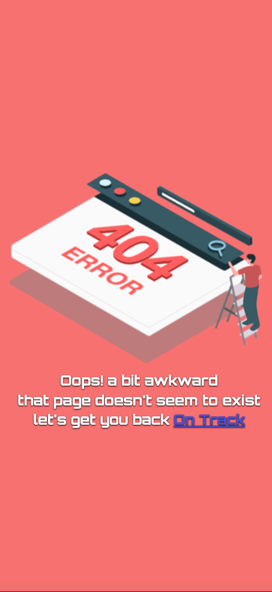

# With Bloom v1

WithBloom is a startup that helps people discover new coins and their market rates.

## Table of contents

<!--toc:start-->

- [With Bloom v1](#with-bloom-v1)
- [Table of contents](#table-of-contents)
  - [Installation](#installation)
  - [Project structure](#project-structure)
  - [User story](#user-story)
  - [Author](#author)
  - [🔗 Links](#🔗-links)
  - [Features](#features)
  - [Tech Stack](#tech-stack)
  - [Appendix](#appendix)
  <!--toc:end-->

## Installation

- clone repo

  ```bash
      git clone https://github.com/AdamuAbba/with-bloom.git
  ```

- install dependencies

  ```bash
      npm install
  ```

- run test

  ```bash
      npm run test
  ```

- run build

  ```bash
     npm run build
  ```

## Project structure

- Authentication Route
  - Login Screen
  - Signup Screen
- Dashboard Route
  - Coin List Screen
  - Exchange rate calculator Screen

   

## User story

- A user registers and signs in with [firebase Authentication](https://firebase.google.com/),
  - A new users data is saved to [firebase Firestore](https://firebase.google.com/).
- Access to the `Dashboard Route` is granted. -Here, a user proceeds to view available coins or use the exchange rate calculator
- A user signs out with the `Exit` button on the top right corner of the **`Coin List Screen`**

## Author

- [Abba Adamu](https://github.com/AdamuAbba)

## 🔗 Links

<a href="https://www.facebook.com/izshytypes" target="_blank">

</a>
<a href="https://www.instagram.com/shytypes1028/" target="_blank">

</a>
<a href="https://twitter.com/shytypes1028">

</a>
<a href="https://abbaportfolio.netlify.app/"  target="_blank">

</a>
<a href="https://www.linkedin.com/in/abba-adamu-365a9b17a/">

</a>

## Features

- Basic design
- Form state handling with [React Hook Form](https://react-hook-form.com)
- Basic form validation with [zod validation](https://zod.dev/)
- [firebase Authentication](https://firebase.google.com/)
- [firebase Firestore to store user credentials](https://firebase.google.com/)
- **API url is embeded within app using environment variables**
- [Redux toolkit](https://redux-toolkit.js.org) state management

## Tech Stack

**Client:**     

**Server:** 

**Host:** 

- build and deployment process is triggered by netlify bots from `main` branch

## Appendix

**Implementation summary:**

- RTKQuery for api access layer, http request and data caching
- Each component is modularized for optimal testing and development

```bash
Component "folder level"
│   Component.test.tsx
│   Component.tsx
│   index.tsx

```

- all firebase implementations can be monitored from the Google developer console.
